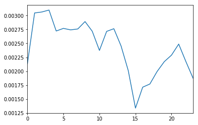
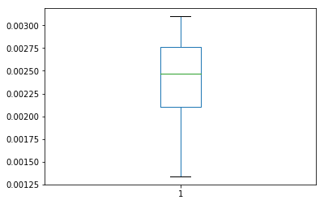
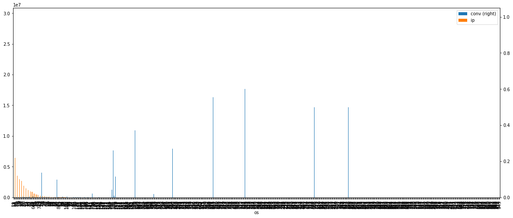
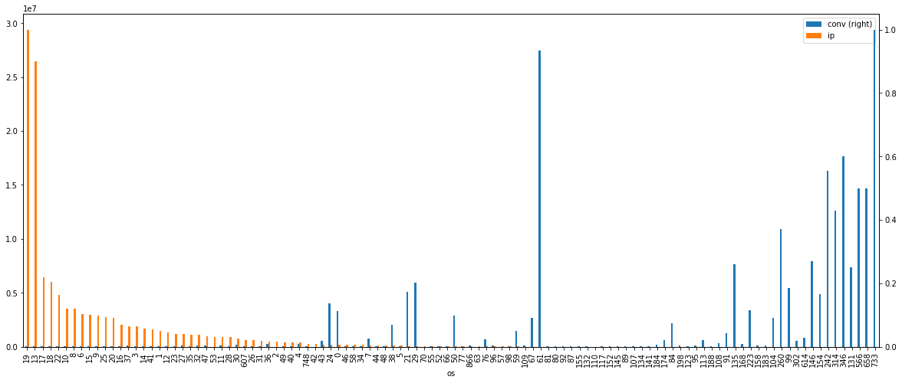
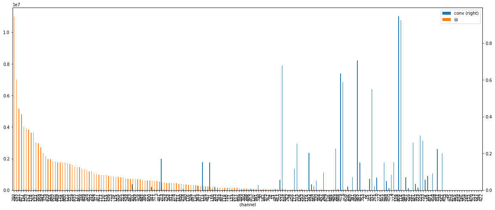
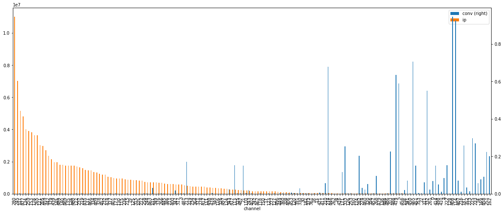
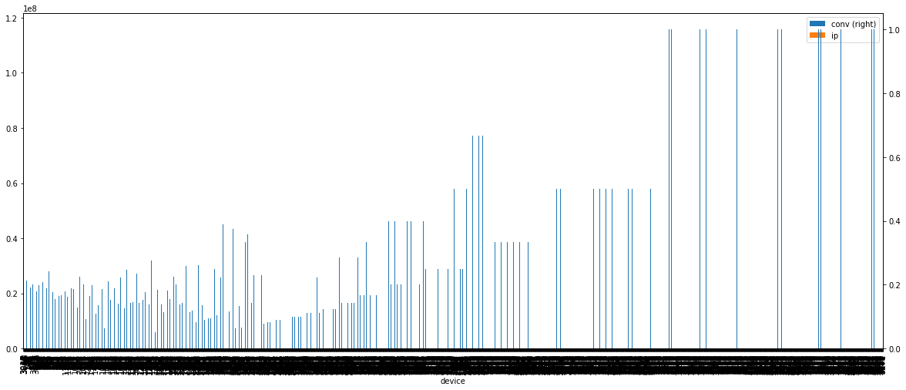
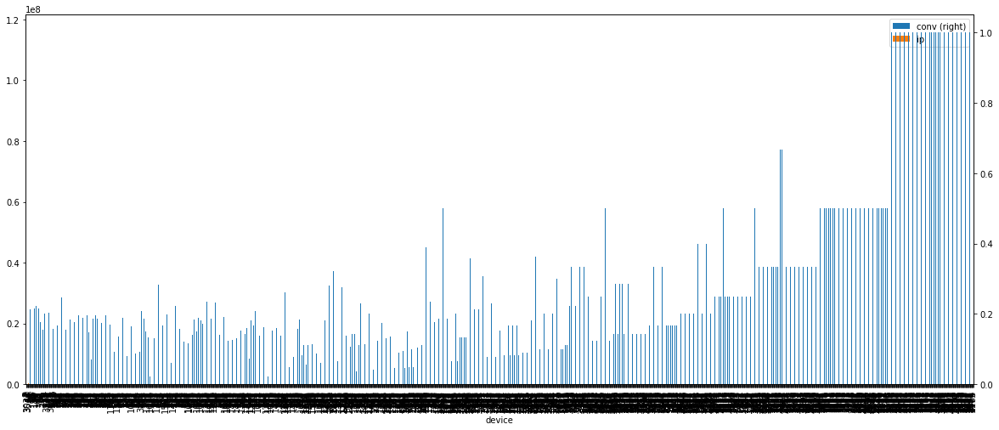
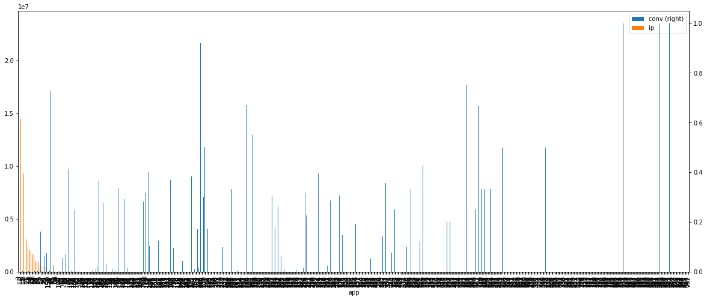
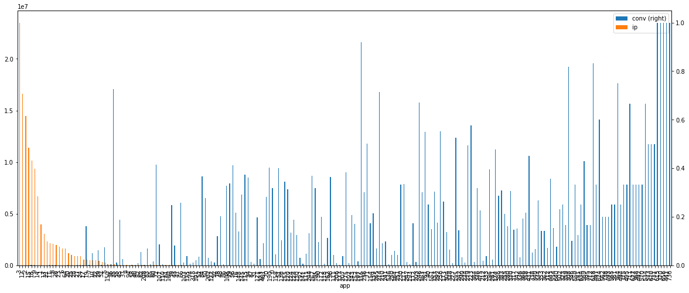

# Introduction

This notebook intends to analyse and implement a basic classification on a Kaggle competition dataset (https://www.kaggle.com/c/talkingdata-adtracking-fraud-detection). The dataset is from https://www.talkingdata.com, a Chinese big data service platform. The interesting - and challenging the same time - about this competition was the nature of the data. It greatly resembles online web analytics/clickstream data both in size but also in the way that most people are used to intepret attribution; particularly the Last Touch Channel/Value model.

# Setup, data loading and formatting

Let's import all the libraries needed first


```python
import numpy as np # linear algebra
import pandas as pd # data processing, CSV file I/O (e.g. pd.read_csv)

import os
import gc
import sys
main_dir = "../input/"
main_dir = ""
# Import all necessary libraries
# datetime for time/date-related manipulations
from datetime import datetime
from datetime import timedelta

# Model training and evaluation tools
from sklearn.model_selection import train_test_split
from sklearn.model_selection import GridSearchCV
from sklearn.ensemble import RandomForestClassifier
from sklearn.metrics import accuracy_score, auc,f1_score, recall_score, precision_score,roc_auc_score
from sklearn.pipeline import Pipeline

from sklearn.externals import joblib

import matplotlib as plt
%matplotlib inline
```

Load the training data set. It is important to set the data types manually so that the size remains manageable even in a small 8GB Ram laptop.


```python
data_types = {'click_id':'uint32','ip':'uint32', 'app':'uint16','device':'uint16',
                      'os':'uint16','channel':'uint16', 'is_attributed': 'uint8'}

# Select only appropriate lines to keep data as small as possible.
starting_line = 9308568 + 1
number_of_lines = 122578385

train_sample = pd.read_csv(
    main_dir + 'train.csv', 
    dtype = data_types,
    skiprows= starting_line, 
    nrows= number_of_lines, 
    header= None, 
    names = ['ip','app','device','os','channel','click_time','attributed_time','is_attributed']
)

train_sample.info()
```

    <class 'pandas.core.frame.DataFrame'>
    RangeIndex: 122578385 entries, 0 to 122578384
    Data columns (total 8 columns):
    ip                 uint32
    app                uint16
    device             uint16
    os                 uint16
    channel            uint16
    click_time         object
    attributed_time    object
    is_attributed      uint8
    dtypes: object(2), uint16(4), uint32(1), uint8(1)
    memory usage: 3.3+ GB


#### Columns descriptions (from Kaggle):

Each row of the training data contains a click record, with the following features.

- ip: ip address of click.<br>
- app: app id for marketing.<br>
- device: device type id of user mobile phone (e.g., iphone 6 plus, iphone 7, huawei mate 7, etc.)<br>
- os: os version id of user mobile phone<br>
- channel: channel id of mobile ad publisher<br>
- click_time: timestamp of click (UTC)<br>
- attributed_time: if user download the app for after clicking an ad, this is the time of the app download<br>
- is_attributed: the target that is to be predicted, indicating the app was downloaded<br>
Note that ip, app, device, os, and channel are encoded.<br>

The test data is similar, with the following differences:<br>

- click_id: reference for making predictions<br>
- is_attributed: not included

The attribution time column is not needed any more, let's save some memory.


```python
main_data = train_sample.drop(['attributed_time'], axis = 1)
del train_sample
gc.collect()
```


    24


The feature extraction functions are defined below. The basic operations executed are:<br>
1. Format the column click_time into appropriate day, hour, minute columns<br>
2. Perform per day and hour groupings of the four key dimensions; app, os, device & channel


```python
def grp_dim_by_hour(df, dimension):
    return df[['ip','day','hour',dimension]].groupby(by = ['day','hour',dimension]).count().reset_index().rename(index=str, columns={"ip": str(dimension + "_instances_by_hour")})

def format_data(df):
    df['hour'] = pd.to_datetime(df.click_time).dt.hour.astype('uint8')
    df['day'] = pd.to_datetime(df.click_time).dt.day.astype('uint8')
    df['minute'] = pd.to_datetime(df.click_time).dt.minute.astype('uint8')
    df = df.drop(['click_time'], axis = 1)
    gc.collect()
    
    fixed_dimensions = ['app','device','channel','os']
    for dim in fixed_dimensions:
        grouping_by_dim = grp_dim_by_hour(df, dim)
        df = pd.merge(df, grouping_by_dim, how = 'left', on = [dim,'day','hour'])
    
    del grouping_by_dim
    gc.collect()
    
    return(df)
```

Plotting helper functions


```python
def print_conversion_by_dim(df, dimension, sort_by = 'ip', asc = False):
    df = df.groupby(by = dimension)
    conversions = df[['is_attributed']].sum().reset_index()
    totals = df[['ip']].count().reset_index()
    grouping = pd.merge(totals, conversions, on = dimension) 
    grouping['conv'] = grouping.apply(lambda r: r['is_attributed']/r['ip'], axis = 1)
    grouping = grouping.sort_values(by = sort_by, ascending= asc)
    grouping[[dimension,'conv','ip']].plot(kind = 'bar', x = dimension, y = ['conv','ip'], figsize=(20, 8), secondary_y = 'conv')
    del conversions, totals
    gc.collect()
    return grouping

def print_conversion_by_dim_for_converting_values(df, dimension, conversion_threshold = 0):
    rows_with_conv = df[df['conv'] > conversion_threshold][dimension]
    final_df = main_data[main_data[dimension].isin(rows_with_conv)][[dimension,'ip','is_attributed']]
    res = print_conversion_by_dim(final_df, dimension, 'ip')
```

Let's format the main data.


```python
main_data = format_data(main_data)
```

We can see below that now extra columns have been added along with their types and same sample values.


```python
print(main_data.info())
print(main_data.head())
```

    <class 'pandas.core.frame.DataFrame'>
    Int64Index: 122578385 entries, 0 to 122578384
    Data columns (total 13 columns):
    ip                           uint32
    app                          uint16
    device                       uint16
    os                           uint16
    channel                      uint16
    is_attributed                uint8
    hour                         uint8
    day                          uint8
    minute                       uint8
    app_instances_by_hour        int64
    device_instances_by_hour     int64
    channel_instances_by_hour    int64
    os_instances_by_hour         int64
    dtypes: int64(4), uint16(4), uint32(1), uint8(4)
    memory usage: 6.4 GB
    None
          ip  app  device  os  channel  is_attributed  hour  day  minute  \
    0  70712    2       1  32      237              0     0    7       0   
    1  45892    3       1  25      424              0     0    7       0   
    2  37774    8       2  13      145              0     0    7       0   
    3  41179    2       1  13      122              0     0    7       0   
    4  83111   15       1   8      245              0     0    7       0   
    
       app_instances_by_hour  device_instances_by_hour  channel_instances_by_hour  \
    0                 337709                   3456007                      39299   
    1                 718328                   3456007                      34236   
    2                  95558                    100959                      90581   
    3                 337709                   3456007                      55314   
    4                 307250                   3456007                     123593   
    
       os_instances_by_hour  
    0                 30570  
    1                 83282  
    2                780926  
    3                780926  
    4                104922  


```python
desc = main_data.describe()
```


```python
desc.applymap("{0:.0f}".format)
```


<div>
<style>
    .dataframe thead tr:only-child th {
        text-align: right;
    }

    .dataframe thead th {
        text-align: left;
    }

    .dataframe tbody tr th {
        vertical-align: top;
    }
</style>
<table border="1" class="dataframe">
  <thead>
    <tr style="text-align: right;">
      <th></th>
      <th>ip</th>
      <th>app</th>
      <th>device</th>
      <th>os</th>
      <th>channel</th>
      <th>is_attributed</th>
      <th>hour</th>
      <th>day</th>
      <th>minute</th>
      <th>app_instances_by_hour</th>
      <th>device_instances_by_hour</th>
      <th>channel_instances_by_hour</th>
      <th>os_instances_by_hour</th>
    </tr>
  </thead>
  <tbody>
    <tr>
      <th>count</th>
      <td>122578385</td>
      <td>122578385</td>
      <td>122578385</td>
      <td>122578385</td>
      <td>122578385</td>
      <td>122578385</td>
      <td>122578385</td>
      <td>122578385</td>
      <td>122578385</td>
      <td>122578385</td>
      <td>122578385</td>
      <td>122578385</td>
      <td>122578385</td>
    </tr>
    <tr>
      <th>mean</th>
      <td>89147</td>
      <td>12</td>
      <td>25</td>
      <td>23</td>
      <td>272</td>
      <td>0</td>
      <td>9</td>
      <td>8</td>
      <td>29</td>
      <td>302807</td>
      <td>2689678</td>
      <td>89540</td>
      <td>353634</td>
    </tr>
    <tr>
      <th>std</th>
      <td>64655</td>
      <td>15</td>
      <td>275</td>
      <td>57</td>
      <td>128</td>
      <td>0</td>
      <td>6</td>
      <td>0</td>
      <td>17</td>
      <td>222878</td>
      <td>892388</td>
      <td>100278</td>
      <td>327954</td>
    </tr>
    <tr>
      <th>min</th>
      <td>1</td>
      <td>0</td>
      <td>0</td>
      <td>0</td>
      <td>0</td>
      <td>0</td>
      <td>0</td>
      <td>7</td>
      <td>0</td>
      <td>1</td>
      <td>1</td>
      <td>1</td>
      <td>1</td>
    </tr>
    <tr>
      <th>25%</th>
      <td>40216</td>
      <td>3</td>
      <td>1</td>
      <td>13</td>
      <td>145</td>
      <td>0</td>
      <td>4</td>
      <td>7</td>
      <td>14</td>
      <td>97739</td>
      <td>2712312</td>
      <td>26365</td>
      <td>56774</td>
    </tr>
    <tr>
      <th>50%</th>
      <td>79734</td>
      <td>12</td>
      <td>1</td>
      <td>18</td>
      <td>259</td>
      <td>0</td>
      <td>9</td>
      <td>8</td>
      <td>29</td>
      <td>281084</td>
      <td>2961353</td>
      <td>53878</td>
      <td>155762</td>
    </tr>
    <tr>
      <th>75%</th>
      <td>118475</td>
      <td>15</td>
      <td>1</td>
      <td>19</td>
      <td>386</td>
      <td>0</td>
      <td>14</td>
      <td>8</td>
      <td>44</td>
      <td>438842</td>
      <td>3175292</td>
      <td>106607</td>
      <td>710603</td>
    </tr>
    <tr>
      <th>max</th>
      <td>364776</td>
      <td>762</td>
      <td>4212</td>
      <td>945</td>
      <td>498</td>
      <td>1</td>
      <td>23</td>
      <td>8</td>
      <td>59</td>
      <td>842094</td>
      <td>3471206</td>
      <td>476135</td>
      <td>921314</td>
    </tr>
  </tbody>
</table>
</div>


Basic data coverage (date and hour range). This helps us confirm that we only have data for day 7 and 8. Day 7 will act as our training set and 8 as our validation set.


```python
print(pd.crosstab(main_data['hour'],main_data['day']))
```

    day         7        8
    hour                  
    0     3604365  3493769
    1     3308150  3065649
    2     3095633  3585843
    3     3220271  3172056
    4     3645493  3545132
    5     3227349  3160269
    6     2917284  2983655
    7     2924033  3155262
    8     2801293  2976057
    9     2961319  3068314
    10    3300746  3377086
    11    3134200  3430977
    12    3000091  3485357
    13    3235239  3616634
    14    3161797  3676695
    15    2864021  3336168
    16    2314780  2455567
    17    1263077  1387383
    18     726684   794088
    19     493056   554053
    20     409255   447324
    21     518866   550518
    22    1172535  1260525
    23    2333773  2366694


As I am working on online analytics, conversion rate is never left out of the discussion. So let's check the typical conversion rate over hour for both days.


```python
tmp = pd.crosstab(main_data['hour'], main_data['is_attributed']).apply(lambda r: r/r.sum(), axis=1)
```


```python
tmp.reset_index()[1].plot()
```


    <matplotlib.axes._subplots.AxesSubplot at 0x1adc5ff350>





```python
tmp.reset_index()[1].plot(kind = 'box')
```


    <matplotlib.axes._subplots.AxesSubplot at 0x1adc5ff090>





Conversion rate in general fluctuates from 0.1% to 0.3%. Very low rate and highly unbalanced classification problem. The positive label is extremely rare.

# Examination of core dimensions

It is worth investigating how our core dimensions are distributed (volume of "visits" spread over different values) in comparison to their respective conversion rate. In other words, is there a particular segment of those dimensions that converts particularly well?

Our core dimensions are:<br>
1) Operating System<br>
2) Channel (Similar to marketing channels in online analytics? Maybe)<br>
3) Device<br>
4) Application<br>

### 1) Operating System

The OS dimension has decent amount of unique values but not the highest.


```python
print('Unique OS values: ' + str(len(main_data.os.unique())))
```

    Unique OS values: 673


Let's examing the conversion in relation to its volume across the different values.


```python
os_conv = print_conversion_by_dim(main_data[['os','ip','is_attributed']], dimension = 'os')
```





It looks like a small portion of values contain the majority of the volume. Regarding Conversion, There are some spikes here and there but nothing stands out. Let's see what happens when we inspect only OS values that display a conversion value greater than 0.


```python
print_conversion_by_dim_for_converting_values(os_conv, 'os')
```





Now the total volume of OS values has decreased dramatically but for the high volume Operating Systems, conversion remains at small levels.

### 2) Channel

Applying the same logic on Channel, we notice the same behaviour. The only difference is that there are more high volume values that have decent conversion while the total number of unique values is relatively small. That probably indicates that this dimension has bigger impact on predicting the positive outcome.


```python
print('Unique Channel values: ' + str(len(main_data.channel.unique())))
```

    Unique Channel values: 194


```python
res = print_conversion_by_dim(main_data[['channel','ip','is_attributed']], 'channel')
```





```python
print_conversion_by_dim_for_converting_values(res, 'channel')
```





### 3) Device

Device does not look as promising as the previous two dimensions. It has way more unique values and by applying the same logic as before, one can infeer that it is not a stable and reliable feature (at least for conversion).


```python
print('Unique Device values: ' + str(len(main_data.device.unique())))
```

    Unique Device values: 2928


```python
res = print_conversion_by_dim(main_data[['device','ip','is_attributed']], 'device')
```





```python
print_conversion_by_dim_for_converting_values(res, 'device')
```





### 4) App

App is similar to the Operating System in terms of volume and conversion to volume alignment. So we would expect that to be affecting on similar levels the final outcome.


```python
print('Unique App values: ' + str(len(main_data.app.unique())))
```

    Unique App values: 667


```python
res = print_conversion_by_dim(main_data[['app','ip','is_attributed']], 'app')
```





```python
print_conversion_by_dim_for_converting_values(res, 'app')
```





## Model Training

Building the test and training sets for training the model.


```python
features = ['app','device','os','channel','hour','day','minute', 'app_instances_by_hour', 'os_instances_by_hour', 'device_instances_by_hour',  'channel_instances_by_hour']

# Selecting these timeslot to make the data set smaller and minimize the training period. 
# The reason for that is the final test set that will be uploaded on Kaggle contains only those timeslots.
# So this simplifies the work.
is_test_set_hour_slots = (
    (main_data['hour'] >= 4) & (main_data['hour'] <= 5) |
    (main_data['hour'] >= 9) & (main_data['hour'] <= 10) |
    (main_data['hour'] >= 13) & (main_data['hour'] <= 14)
)

is_train_set = (main_data['day'] == 7) & is_test_set_hour_slots

is_test_set = (main_data['day'] == 8) & is_test_set_hour_slots
```


```python
X_train = main_data[is_train_set][features]
y_train = main_data[is_train_set]['is_attributed']

X_test = main_data[is_test_set][features]
y_test = main_data[is_test_set]['is_attributed']

del is_train_set
del is_test_set
# del main_data
gc.collect()
```


    474


For the actual model fitting, I had to experiment for different parameters' values. There is more room for improvement here given adequate time.


```python
print('Start model building')
rf_cls = RandomForestClassifier(class_weight = 'balanced', min_samples_leaf = 5, min_samples_split= 4, max_depth= 10)
gc.collect()
rf_cls.fit(X_train , y_train)
```

    Start model building


    RandomForestClassifier(bootstrap=True, class_weight='balanced',
                criterion='gini', max_depth=10, max_features='auto',
                max_leaf_nodes=None, min_impurity_decrease=0.0,
                min_impurity_split=None, min_samples_leaf=5,
                min_samples_split=4, min_weight_fraction_leaf=0.0,
                n_estimators=10, n_jobs=1, oob_score=False, random_state=None,
                verbose=0, warm_start=False)


Saving a model is always a good idea!


```python
print('Start model saving')
joblib.dump(rf_cls, 'model_rf_cls-965-auc.pkl') 
print('End model saving')
```

    Start model saving
    End model saving


### Model evaluation on test set.

We need to calculate different key metrics but we will focus on the ROC curce (https://en.wikipedia.org/wiki/Receiver_operating_characteristic) as this is used by Kaggle to rank the results.


```python
predictions = rf_cls.predict(X_test)
print('Accuracy ' + str(accuracy_score(y_test,predictions)))
print('Precision '+ str(precision_score(y_test,predictions)))
print('Recall ' + str(recall_score(y_test,predictions)))
print('F1-score ' + str(f1_score(y_test,predictions)))
predictions_proba = rf_cls.predict_proba(X_test)
print('ROC AUC : ' + str(roc_auc_score(y_test, predictions_proba[:,1])))
```

    Accuracy 0.976516095329
    Precision 0.0863119924384
    Recall 0.874130655622
    F1-score 0.157110804462
    ROC AUC : 0.965332881417


By ispecting the confusion matrix, we notice that we fail to incorectly identify nearly 6.5k instances of possitive labels. There are also 500k instances of false negatives. This initially might sound a lot. However out of total 20M negative labels that's around 2.5% of incorrectly classified negative labels. 

Also our recal value is quite decent 0.874; true positives / (true positives + false negatives).


```python
print(pd.crosstab(y_test,predictions, rownames=['Actual Value'],colnames=['Predicted Value']))
```

    Predicted Value         0       1
    Actual Value                     
    0                19919277  473665
    1                    6443   44745


Based on the ROC value (>0.96) along with the fact we are dealing with highly unbalanced labels, we can safely say the model is performing well on our test set.

But which features had a big impact on the results?


```python
print('Feature Importance')
print('------------------')
for index in np.flip(np.argsort(rf_cls.feature_importances_, ), axis = 0):
    print(X_test.columns[index] + ' : ' + str(rf_cls.feature_importances_[index]))
print('------------------')
print('End model building')
```

    Feature Importance
    ------------------
    app_instances_by_hour : 0.322135591494
    channel_instances_by_hour : 0.317296133808
    app : 0.193734732818
    channel : 0.0492415978581
    os_instances_by_hour : 0.0401457907252
    device : 0.0381228367606
    device_instances_by_hour : 0.0300360024443
    os : 0.00651657484116
    minute : 0.00139371430375
    hour : 0.00137702494694
    day : 0.0
    ------------------
    End model building


```python
false_negatives = (y_test == 1) & (predictions == 0) # This is the data-set that we need to improve, incorrectly classified positive labels
false_positives = (y_test == 0) & (predictions == 1)
true_positives = (y_test == 1) & (predictions == 1)
true_negatives = (y_test == 0) & (predictions == 0)
```


```python
false_negatives = main_data.loc[false_negatives.values.tolist()]
false_positives = main_data.loc[false_positives.values.tolist()]
true_positives = main_data.loc[true_positives.values.tolist()]
true_negatives = main_data.loc[true_negatives.values.tolist()]
```

## Final predictions


```python
## Load Training Set
test_sample = pd.read_csv(main_dir + 'test.csv', dtype = data_types) 
```


```python
test_sample.info()
```

    <class 'pandas.core.frame.DataFrame'>
    RangeIndex: 18790469 entries, 0 to 18790468
    Data columns (total 7 columns):
    click_id      uint32
    ip            uint32
    app           uint16
    device        uint16
    os            uint16
    channel       uint16
    click_time    object
    dtypes: object(1), uint16(4), uint32(2)
    memory usage: 430.1+ MB


```python
test_sample = format_data(test_sample)
```


```python
test_sample.head()
```


<div>
<style>
    .dataframe thead tr:only-child th {
        text-align: right;
    }

    .dataframe thead th {
        text-align: left;
    }

    .dataframe tbody tr th {
        vertical-align: top;
    }
</style>
<table border="1" class="dataframe">
  <thead>
    <tr style="text-align: right;">
      <th></th>
      <th>click_id</th>
      <th>ip</th>
      <th>app</th>
      <th>device</th>
      <th>os</th>
      <th>channel</th>
      <th>hour</th>
      <th>day</th>
      <th>minute</th>
      <th>app_instances_by_hour</th>
      <th>device_instances_by_hour</th>
      <th>channel_instances_by_hour</th>
      <th>os_instances_by_hour</th>
    </tr>
  </thead>
  <tbody>
    <tr>
      <th>0</th>
      <td>0</td>
      <td>5744</td>
      <td>9</td>
      <td>1</td>
      <td>3</td>
      <td>107</td>
      <td>4</td>
      <td>10</td>
      <td>0</td>
      <td>475418</td>
      <td>3175341</td>
      <td>214877</td>
      <td>51117</td>
    </tr>
    <tr>
      <th>1</th>
      <td>1</td>
      <td>119901</td>
      <td>9</td>
      <td>1</td>
      <td>3</td>
      <td>466</td>
      <td>4</td>
      <td>10</td>
      <td>0</td>
      <td>475418</td>
      <td>3175341</td>
      <td>84232</td>
      <td>51117</td>
    </tr>
    <tr>
      <th>2</th>
      <td>2</td>
      <td>72287</td>
      <td>21</td>
      <td>1</td>
      <td>19</td>
      <td>128</td>
      <td>4</td>
      <td>10</td>
      <td>0</td>
      <td>77207</td>
      <td>3175341</td>
      <td>83619</td>
      <td>796537</td>
    </tr>
    <tr>
      <th>3</th>
      <td>3</td>
      <td>78477</td>
      <td>15</td>
      <td>1</td>
      <td>13</td>
      <td>111</td>
      <td>4</td>
      <td>10</td>
      <td>0</td>
      <td>209436</td>
      <td>3175341</td>
      <td>14481</td>
      <td>698518</td>
    </tr>
    <tr>
      <th>4</th>
      <td>4</td>
      <td>123080</td>
      <td>12</td>
      <td>1</td>
      <td>13</td>
      <td>328</td>
      <td>4</td>
      <td>10</td>
      <td>0</td>
      <td>396028</td>
      <td>3175341</td>
      <td>38063</td>
      <td>698518</td>
    </tr>
  </tbody>
</table>
</div>


```python
print(pd.crosstab(test_sample['hour'],test_sample['day']))
```

    day        10
    hour         
    4     3344125
    5     2858427
    6         381
    9     2984808
    10    3127993
    11        413
    13    3212566
    14    3261257
    15        499


```python
predictions = rf_cls.predict_proba(test_sample[features])
d = {'click_id': test_sample['click_id'], 'is_attributed': predictions[:,1]}
df = pd.DataFrame(data=d)
df.to_csv('output.csv', index= False)
```

The specific model achieves <b>0.9231350</b> on the public score. Given the small drop in AUC compared to our validation set, I would say this might have to do with the day of the week as well. For example, it might be the case that the data we use to train and validate the model are from weekdays and the test set from weekend (or vise versa).  But overall it is a good and promising result.
